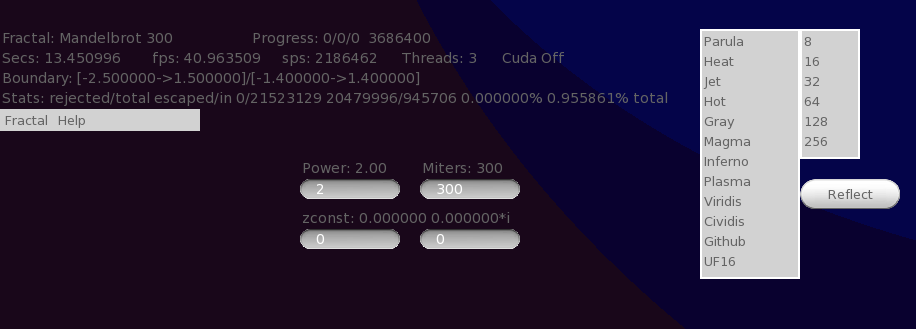
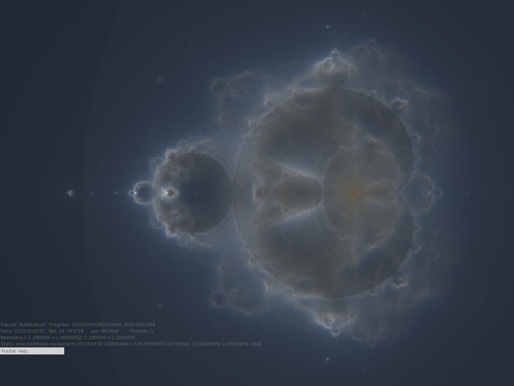
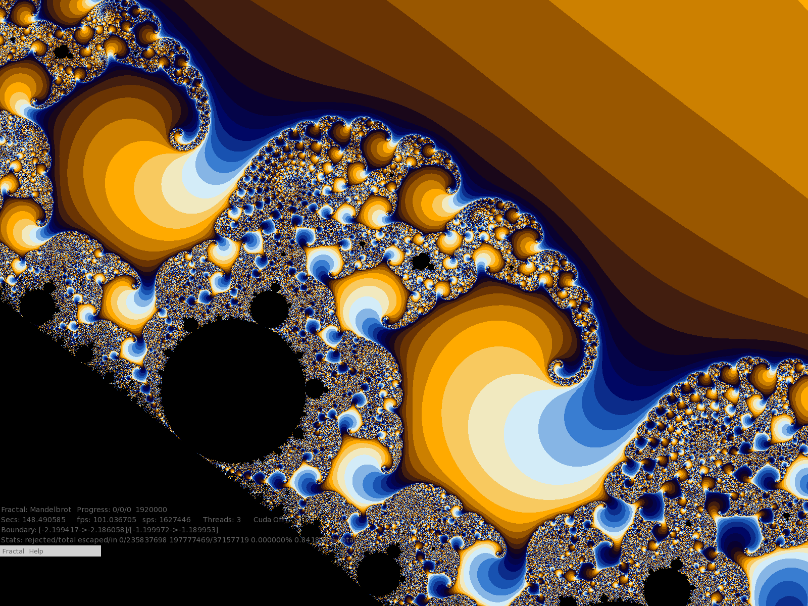
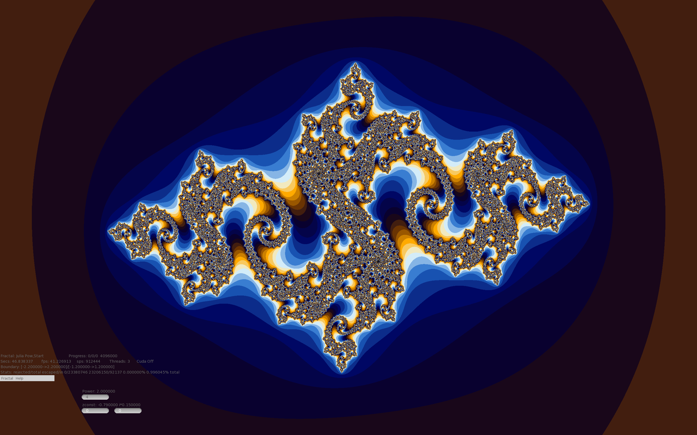

# Demonstration code
This contains several programs for demonstration purposes

## ode_simulation directory
C++ 3D particle and trail simulation of many strange attractor ordinary
differential equations. It was written using sfml and tgui libraries.
Features include:
* Zoomable,rotatable (Euler Angle sliders (Theta)), translatable frame of reference
* Various keyboard and mouse and gui controls for things like DE parameters
* Changeable particle and trail settings
* Skinned modern GUI elements (Sliders, Button, Menus, etc)
* Escaped particle detection
* On Screen Axes to indicate rotation
* Screenshots via hotkey
* Hide all widgets via hotkey
* Color maps that color the trails and particles
* Textures for moving circles

## fractals directory
A C++/sfml/tgui/CUDA GUI framework to display/explore fractals. Features:
* Detects number of cores and uses all of them to speed rendering.
* Detects CUDA device and uses it.  CUDA on/off toggle
* Fractal status and selection GUI
* Mouse and Keyboard and GUI Controls
* Mouse: wheel to zoom, right click to recenter pan, left click/hold/drag to select a rectangle and zoom to it.
* GUI settable fractal parameters: power and zconst(julia style)
* GUI selectable color palettes and color cycle size options
* Screenshot hotkey and hide all widgets hotkey
* Crop an area of the fractal (displays border) and it will zoom to crop.
* Mandelbrot (zoom and pan via mouse) Threaded.
* Julia (zoom and pan via mouse) Threaded.
* Spiral Septagon (zoom and pan via mouse) Threaded.
* Buddhabrot(Nebulabrot). Threaded and CUDA optimized(no settable power support for cuda). Will run threads on all the cores to generate the image. To generate the image needs a lot of CPU. The threads have been optimized to generate the image very fast.
On my AMD 16 core machine, the full 16 threads on all cores version is about twice as fast as CUDA and no threads.
CUDA programming is very finicky and there is probably lots of room for improvement.
Nevertheless, its a massive improvement over one AMD thread doing the work.

## hex directory
Has a c++ implementation of the game hex
using threaded Monte Carlo simulation.
Concepts include these graph algorithms:
* Kruskal Minimum Spanning Tree
* Prim Minimum Spanning Tree
* Dijkstra’s shortest path
* Union Find

## maximum_path_sum directory
Has a solution to the maximum sum of a non forked path in a binary tree.
I found it interesting because some of the solutions on the internet are deficient.
Concepts include:
* pretty printing binary tree
* testing for maximum sum invariance under left right symmetry and tree rotation

## max_connected_color_count directory
This is a harder variant of the flood fill algorithm. We have to find the biggest chunk of 4-way connected colors in the grid and return number of elements in the connected chunk. We dont use recursion. We end up using a tailored Union Find algorithm and memoizing the counts of joined sets in the set heads.

## parallel_algorithms directory
Looks at C++17 STL sort and reduce and for_each using seq,unseq,par,par_unseq execution policies.
Also looks at ways of writing code that make algorithms unparallelizable
and unvectorizable.
Conclusion:
* time your code any time you use an execution policy
* vector size may affect whether or not there is an improvement

