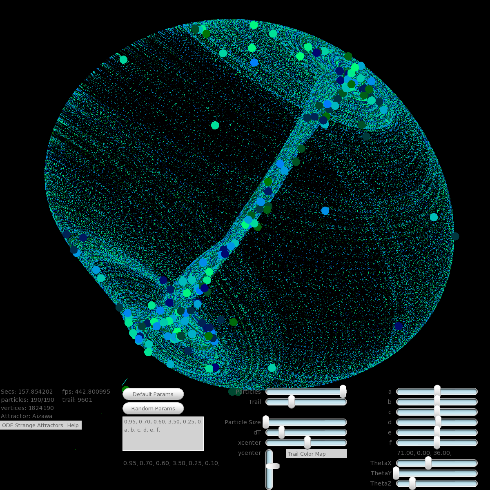

# Demonstration code
This contains several programs for demonstration purposes

## fractals directory
A C++/sfml/tgui/CUDA GUI framework to display/explore fractals. Threaded and CUDA optimized. Features:
* Detects number of cores and uses all of them to speed rendering.
* Detects CUDA device and uses it.  CUDA on/off toggle
* Fractal status and selection GUI
* Mouse and Keyboard and GUI Controls
* Mouse: wheel to zoom, right click to recenter pan, left click/hold/drag to select a rectangle and zoom to it.
* GUI settable fractal parameters: power and zconst(julia style) and max iterations
* GUI selectable color palettes and color cycle size options
* GUI palette reflection button to prevent discontinuities
* Other coloring options including interior coloring, shadow maps, image tiling
* Screenshot hotkey and hide all widgets hotkey and pause cpu usage hotkey
* Crop an area of the fractal (displays border) and it will zoom to crop.
* Save and Load fractal key support from file and from memory
* Mandelbrot (zoom and pan via mouse) Threaded.
* Julia (zoom and pan via mouse) Threaded.
* Spiral Septagon (zoom and pan via mouse) Threaded.
* Nova method fractal (zoom and pan via mouse) Threaded.
* Newton method fractal (zoom and pan via mouse) Threaded.
* Anti-buddhabrot with oversampling
* Buddhabrot(Nebulabrot). Threaded and CUDA optimized(no settable power support for cuda). Will run threads on all the cores to generate the image. To generate the image needs a lot of CPU. The threads have been optimized to generate the image very fast.
On my AMD 16 core machine, the full 16 threads on all cores version is about twice as fast as CUDA and no threads.
CUDA programming is very finicky and there is probably lots of room for improvement.
Nevertheless, its a massive improvement over one hw thread doing the work.

This has been ported to Windows and Ubuntu.

## ode_simulation directory
C++ 3D particle and trail simulation of many strange attractor ordinary
differential equations. It was written using sfml and tgui libraries.
Features include:
* Zoomable,rotatable (Euler Angle sliders (Theta)), translatable frame of reference
* Various keyboard and mouse and gui controls for things like DE parameters
* Changeable particle and trail settings
* Skinned modern GUI elements (Sliders, Button, Menus, etc)
* Escaped particle detection
* On Screen Axes to indicate rotation
* Screenshots via hotkey
* Hide all widgets via hotkey
* Color maps that color the trails and particles
* Textures for moving circles
 
 

## hex directory
Has a c++ implementation of the game hex
using threaded Monte Carlo simulation.
Concepts include these graph algorithms:
* Kruskal Minimum Spanning Tree
* Prim Minimum Spanning Tree
* Dijkstra’s shortest path
* Union Find

## maximum_path_sum directory
Has a solution to the maximum sum of a non forked path in a binary tree.
I found it interesting because some of the solutions on the internet are deficient.
Concepts include:
* pretty printing binary tree
* testing for maximum sum invariance under left right symmetry and tree rotation

## max_connected_color_count directory
This is a harder variant of the flood fill algorithm. We have to find the biggest chunk of 4-way connected colors in the grid and return number of elements in the connected chunk. We dont use recursion. We end up using a tailored Union Find algorithm and memoizing the counts of joined sets in the set heads.

## astar directory
Double sided and directed search (dijkstra and astar) run on real US highway data (courtesy of MIT)
(can produce kml files that are displayable in google maps)
 
https://ocw.mit.edu/courses/electrical-engineering-and-computer-science/6-006-introduction-to-algorithms-fall-2011/assignments/
 
Below is a summary of how making the search double sided and directed improves the search: 
python dijkstra.py.single_sided < tests/0boston_berkeley.in
Path: BOSTON EAST BOST, MA -> BERKELEY, CA
Graph size: 90415 nodes, 250604 edges
Nodes visited: 84458
Path length: 54161784.7363
Number of roads: 732
Time used in seconds: 1.276

python dijkstra.py.single_sided_directed  < tests/0boston_berkeley.in
Path: BOSTON EAST BOST, MA -> BERKELEY, CA
Graph size: 90415 nodes, 250604 edges
Nodes visited: 47100
Path length: 54161784.7363
Number of roads: 732
Time used in seconds: 1.003

python dijkstra.py.double_sided < tests/0boston_berkeley.in
Path: BOSTON EAST BOST, MA -> BERKELEY, CA
Graph size: 90415 nodes, 250604 edges
Nodes visited: 79550
Path length: 54161784.7363
Number of roads: 732
Time used in seconds: 1.241

python dijkstra.py.double_sided_directed  < tests/0boston_berkeley.in
Path: BOSTON EAST BOST, MA -> BERKELEY, CA
Graph size: 90415 nodes, 250604 edges
Nodes visited: 20836
Path length: 54161784.7363
Number of roads: 732
Time used in seconds: 0.403

## parallel_algorithms directory
Looks at C++17 STL sort and reduce and for_each using seq,unseq,par,par_unseq execution policies.
Also looks at ways of writing code that make algorithms unparallelizable
and unvectorizable.
Conclusion:
* time your code any time you use an execution policy
* vector size may affect whether or not there is an improvement

