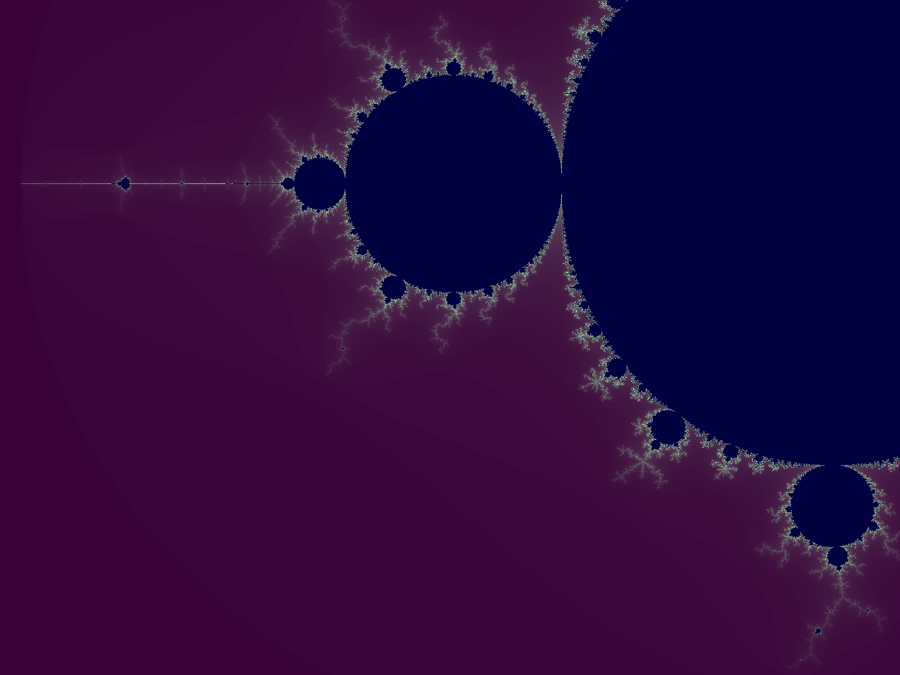

## fractals directory
A C++ GUI framework to display fractals. Features:
* Fractal status and selection GUI
* Mouse and Keyboard and GUI Controls
* Screenshot hotkey and hide all widgets hotkey
* Mandelbrot (zoom and pan via mouse)
* Buddhabrot(Nebulabrot). Will run threads on all the cores to generate the image. To generate the image needs a lot of CPU. The threads have been optimized to generate the image very fast.

