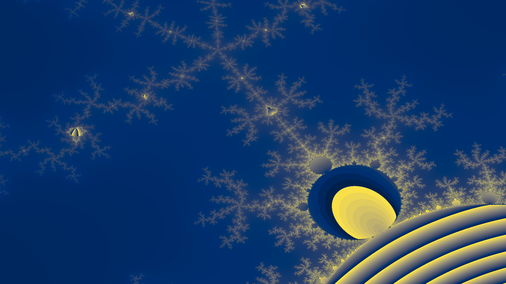
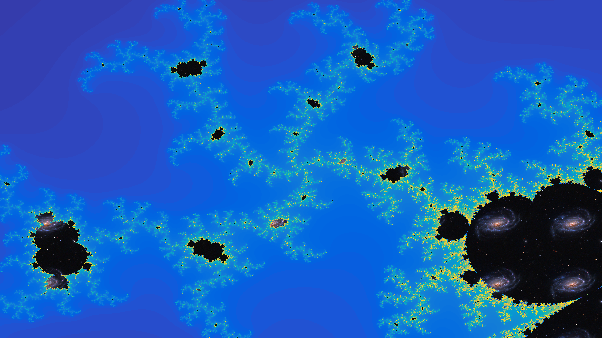
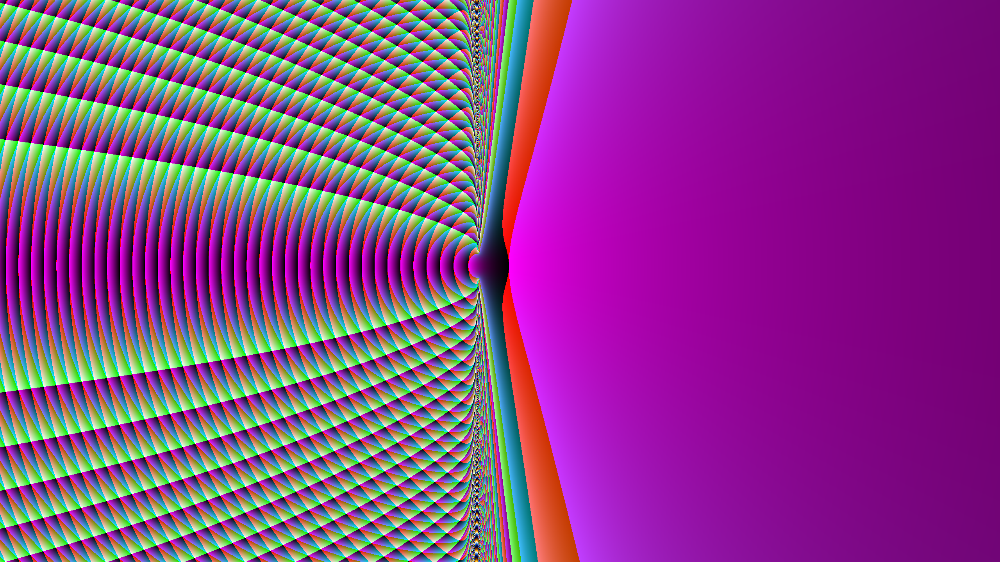
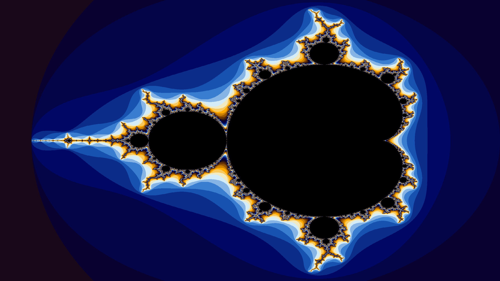
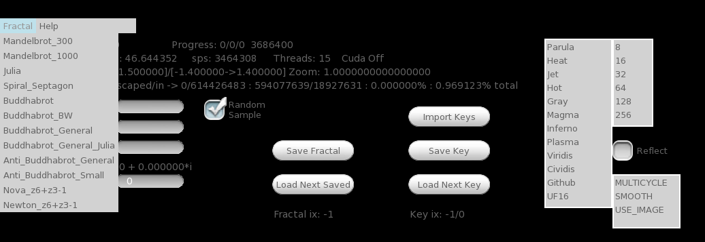

# fractals directory
A C++/sfml/tgui/CUDA GUI framework to display/explore fractals. Threaded and CUDA optimized. Features:
* Detects number of cores and uses all of them to speed rendering.
* Detects CUDA device and uses it.  CUDA on/off toggle
* Fractal status and selection GUI
* Mouse and Keyboard and GUI Controls
* Mouse: wheel to zoom, right click to recenter pan, left click/hold/drag to select a rectangle and zoom to it.
* GUI settable fractal parameters: power and zconst(julia style) and max iterations
* GUI selectable color palettes and color cycle size options
* GUI palette reflection button to prevent discontinuities
* Other coloring options including interior coloring, shadow maps, image tiling
* Screenshot hotkey and hide all widgets hotkey and pause cpu usage hotkey
* Crop an area of the fractal (displays border) and it will zoom to crop.
* Save and Load fractal key support from file and from memory
* Mandelbrot (zoom and pan via mouse) Threaded.
* Julia (zoom and pan via mouse) Threaded.
* Spiral Septagon (zoom and pan via mouse) Threaded.
* Nova method fractal (zoom and pan via mouse) Threaded.
* Newton method fractal (zoom and pan via mouse) Threaded.
* Anti-buddhabrot with oversampling
* Buddhabrot(Nebulabrot). Threaded and CUDA optimized(no settable power support for cuda). Will run threads on all the cores to generate the image. To generate the image needs a lot of CPU. The threads have been optimized to generate the image very fast.
On my AMD 16 core machine, the full 16 threads on all cores version is about twice as fast as CUDA and no threads.
CUDA programming is very finicky and there is probably lots of room for improvement.
Nevertheless, its a massive improvement over one hw thread doing the work.

This has been ported to Windows and Ubuntu.

